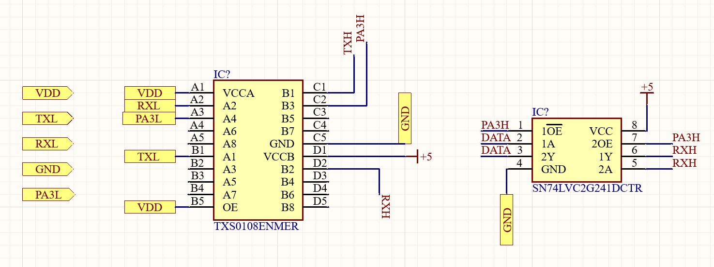
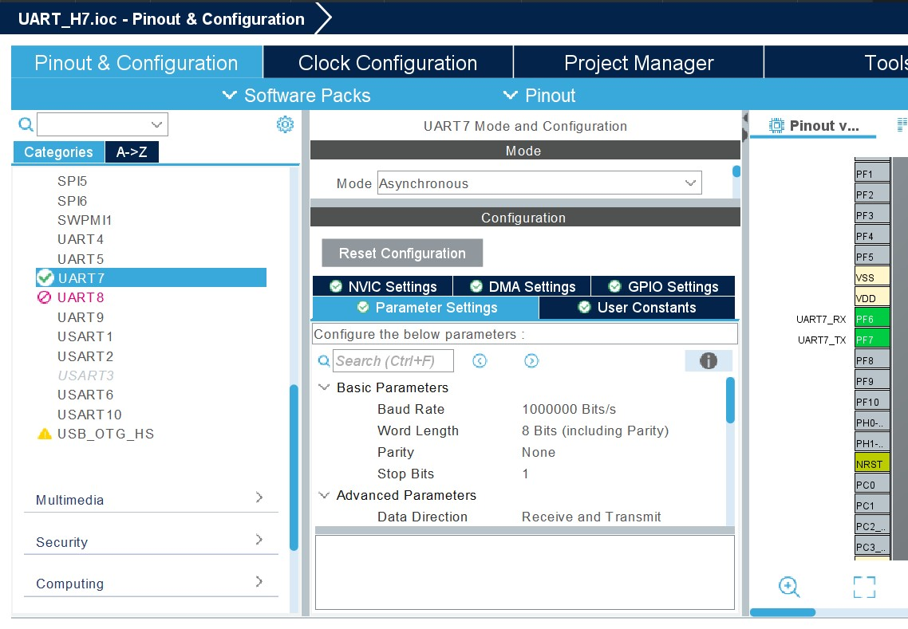
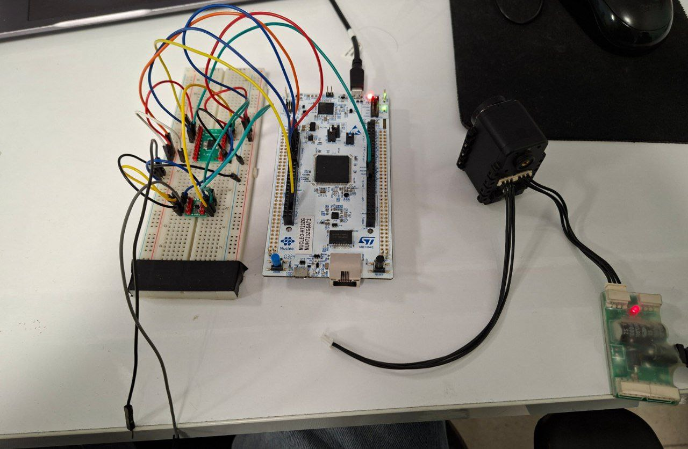

# STM32 HAL Driver for Dynamixel AX-12A

A robust, lightweight C library for controlling **Dynamixel AX-12A** smart servos using **STM32 HAL** (Hardware Abstraction Layer).

This driver implements the **Dynamixel Protocol 1.0** over a single-wire **Half-Duplex Bus**. It utilizes the STM32's standard Full-Duplex UART peripheral, converting it to the required Half-Duplex signaling using an external buffer circuit and GPIO control. It is designed to handle high-speed communication (1 Mbps) with correct direction switching and buffer management to prevent UART Overrun errors.

## 🚀 Features

* **Protocol 1.0 Support:** Full implementation of the instruction set for AX-12A.
* **UART Direction Control:** Manages the Direction Pin (`PA3` in the example) to correctly switch the external buffer between **Transmit (TX)** and **Receive (RX)** modes.
* **Robust Error Handling:** Automatically flushes the RX buffer to prevent UART Overrun (ORE) errors during high-speed writes.
* **Zero-Latency Response:** Reads status packets immediately to ensure synchronization.
* **Vital Functions:**
    * Position / Speed / Torque Control
    * Feedback Reading (Position, Temp, Load, Voltage)
    * SyncWrite / Action / RegWrite support for synchronized movement.
    * Wheel Mode (Endless Turn) vs Joint Mode (0-1023) control.
    * Factory Reset and ID/Baud Rate configuration.

## 🛠 Hardware Setup

This library was developed and tested on a Nucleo-H723ZG, but it is compatible with any STM32 MCU supporting HAL.

Custom Half-Duplex Bus Conversion
The Dynamixel AX-12A uses a single Data wire for communication (Half-Duplex) at 5V logic. Since the STM32's UART peripheral uses separate TX and RX pins at 3.3V, a custom circuit is used to perform two vital functions: Logic Level Shifting (3.3V <-> 5V) and Direction Control (TX <-> RX switching).

Circuit Components
Logic Level Shifter: TXS0108ENMER (Bi-directional, 8-channel)

Tri-state Buffer/Direction Control: SN74LVC2G241DCTR (Dual-channel, non-inverting)

Detailed Wiring
The circuit uses the MCU's 3.3V domain (Side A) and the motor's 5V domain (Side B), with the control pin PA3 managing data flow.
| Connection | MCU Pin/Source | Function | Destination Pin/IC |
| :--- | :--- | :--- | :--- |
| **TX Data** | MCU TX (3.3V) | Level Shift TX | TXS0108E A1 |
| **RX Data** | MCU RX (3.3V) | Level Shift RX | TXS0108E A2 |
| **Direction** | MCU PA3 (3.3V) | Level Shift Direction | TXS0108E A3 |

### Detailed Component Configuration

1.  **TXS0108E (Logic Level Shifter) Configuration:**
    The **TXS0108E** converts the MCU's 3.3V signals to the 5V signals required by the direction buffer and the motor.
    * `VCCA` is connected to **3.3V**.
    * `VCCB` is connected to **5V**.
    * The MCU's **TX**, **RX**, and **PA3** signals are fed to sections **A1**, **A2**, and **A3**, respectively.
    * The 5V-level outputs are labeled as **TXH** (from **B1**), **RXH** (from **B2**), and **PA3H** (from **B3**).

2.  **SN74LVC2G241 (Tri-state Buffer) Configuration:**
    The **SN74LVC2G241** uses the **PA3H** (5V) control signal to switch the single-wire Dynamixel bus between Transmit and Receive.
    * `VCC` is connected to **5V**.
    * The Enable pin **1OE** (not the inverted $\overline{2OE}$ pin) is connected to **PA3H**.
    * The Transmit input **2A** is connected to **TXH** (the 5V TX signal from the level shifter).
    * The common Data Line, labeled **DATA**, is connected to **2Y**. This is the wire that directly connects to the Dynamixel motor's data pin.

3.  **Data Loopback for RX:**
    * The common **DATA** line is also connected to input **A1** of the buffer.
    * The output **Y1** is connected to **RXH** (the 5V input to the level shifter).
    * This completes the loop, allowing the motor's response on the single **DATA** line to be converted back down to the 3.3V **RX** signal for the MCU.


### STM32CubeMX Configuration

1.  **Connectivity -> UARTx (e.g., UART7):**
    * Mode: **Asynchronous**
    * Baud Rate: **1,000,000 bps** (1 Mbps default for AX-12)
    * Word Length: **8 Bits**
    * Parity: **None**
    * Stop Bits: **1**
    
2.  **GPIO:**
    * Select a pin (e.g., `PA3`) as **GPIO_Output**.
    * Label it `DXL_DIR_PIN`. This pin is controlled by the library to switch between TX and RX modes.

## 📂 File Structure

* `AX12.h`: Defines the Control Table (RAM/EEPROM addresses), instruction set, and all public function prototypes.
* `AX12.c`: Implements the core communication logic, including packet construction, checksum calculation, and the necessary HAL UART buffer handling fixes.

## 💻 Usage

### 1. Initialization
Include the header and initialize the handle in your `main.c`.

```c
#include "AX12.h"

AX12_Handle_TypeDef ax12;

int main(void) {
    // HAL Init... SystemClock... MX_UART_Init...

    // 1. Wait for motor to boot (Crucial for cold start)
    HAL_Delay(1000);

    // 2. Initialize the library
    // (Handle, UART Instance, Direction Port, Direction Pin, Motor ID)
    AX12_Init(&ax12, &huart7, GPIOA, GPIO_PIN_3, 0x01);

    // 3. Enable Torque
    AX12_TorqueEnable(&ax12, 1);
    
    // 4. Set Speed (0-1023)
    AX12_SetMovingSpeed(&ax12, 200);

    while (1) {
        // Your code here...
    }
}
```
### 2. Control & Feedback
Demonstrates the core motion and data feedback functions.

```c
uint16_t current_pos = 0;
uint8_t current_temp = 0;

/* Inside while(1) loop */

// Move to position 1023 (CW Limit)
AX12_SetGoalPosition(&ax12, 1023);
HAL_Delay(1000);

// Read current position (0 on success, negative error code on failure)
if (AX12_GetPresentPosition(&ax12, &current_pos) == 0) {
    // Success: current_pos contains value (0-1023)
}

// Read temperature
AX12_GetPresentTemperature(&ax12, &current_temp); 
// current_temp now holds the motor temperature in Celsius.

// Turn Motor LED ON for visual confirmation
AX12_SetLED(&ax12, 1);
HAL_Delay(1000);

// Move back to 0
AX12_SetGoalPosition(&ax12, 0);
AX12_SetLED(&ax12, 0); // Turn LED OFF
HAL_Delay(1000);
```
### 3. Synchronized Movement (RegWrite & Action)
To move multiple motors at the exact same time, use the following sequence:

1.  Call `AX12_RegWriteGoalPosition` for each motor.
2.  Set the motor handle ID to the **Broadcast ID (0xFE)** on a temporary handle.
3.  Call `AX12_Action`.

```c
// Example of synchronized move (assuming two motors: ax12_1 and ax12_2 are initialized)

// 1. Set the pending goal position for each motor
AX12_RegWriteGoalPosition(&ax12_1, 100);
AX12_RegWriteGoalPosition(&ax12_2, 900);

// 2. Create a temporary broadcast handle
AX12_Handle_TypeDef broadcast_handle = ax12_1; // Use any motor's handle as a base
broadcast_handle.ID = AX12_BROADCAST_ID;

// 3. Trigger all registered moves simultaneously
AX12_Action(&broadcast_handle);
```
###  Error Codes and Return Values (Highly Recommended)

Since your library functions return integers (`0` for success, negative for errors), documenting these return codes is crucial for users to debug their code.

## 🛑 Error Codes and Return Values

All functions that return an `int` use the following convention:

| Return Value | Meaning | Description |
| :--- | :--- | :--- |
| `0` | Success | The command was executed, and the status packet was received without errors. |
| `-1` | HAL Timeout | The UART experienced a timeout during the Transmit or Receive operation (usually hardware/wiring issue). |
| `-2` | Invalid Header/ID | The received packet did not start with `0xFF 0xFF` or the ID did not match the requested ID. |
| `-3` to `-255` | Motor Error | The status packet's Error Byte (Index 4) was non-zero. The value is the negative of the motor's error byte. Check the Dynamixel Protocol 1.0 documentation for specific error bit meanings. |

## 📸 Real-World Hardware Integration

The image below illustrates the complete test setup for the STM32 AX-12A driver.


This photo confirms the physical implementation of the custom half-duplex circuit and demonstrates a working connection between the MCU and the motor.

### Key Elements Visible:

* **STM32 Nucleo Board:** The main microcontroller platform (STM32H723ZG) running the HAL-based C driver.
* **Breadboard Circuit:** Contains the custom logic required for communication:
    * The **TXS0108E** Logic Level Shifter (3.3V <-> 5V).
    * The **SN74LVC2G241** Tri-state Buffer for managing the single-wire data line direction via the `PA3` control pin.
* **Dynamixel AX-12A Motor:** The target smart servo, successfully connected to the custom bus interface and ready to receive commands from the STM32.

This setup verifies the hardware layer needed to run the `AX12.c` library successfully at high speed (1 Mbps).
